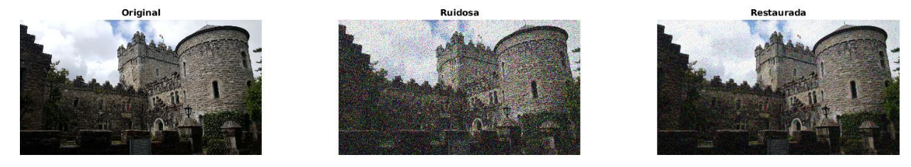
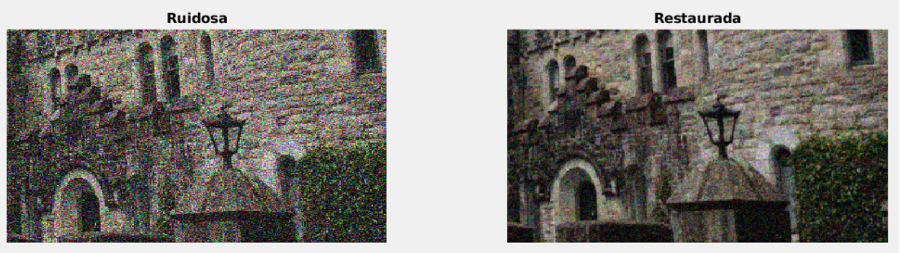
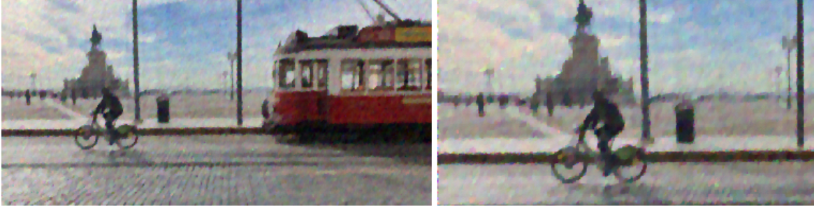
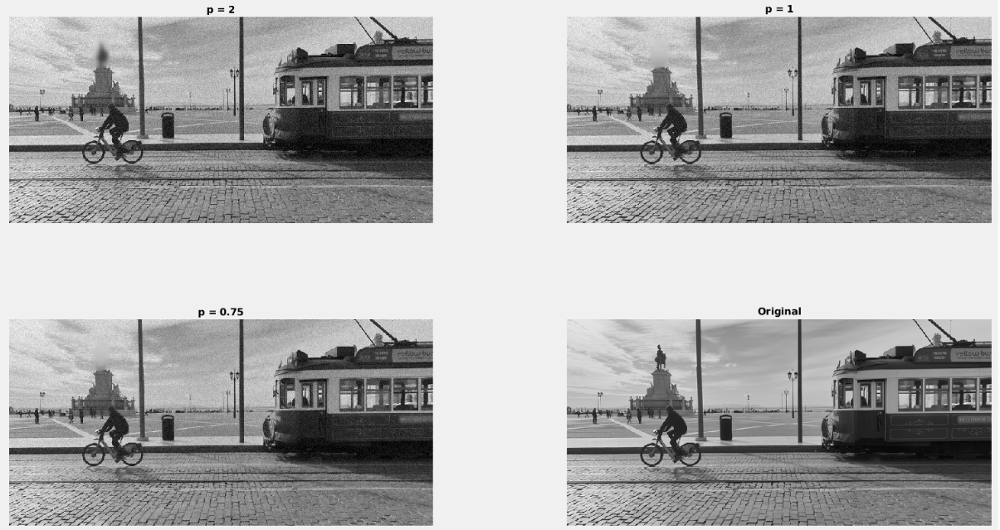

# Variational computing - Image processing

#### 👨‍🎓 This project was carried out during my master's degree in computer vision at URJC - Madrid

Denoising, Impaiting &amp; Deconvolution with matlab

## Goals

- First part : Denoise an image
- Second part : Impaiting &amp; Deconvolution

## Requirements

* Matlab

## Usage

run ```'01 - Denoising'/main.m``` or ```'02 - Impaiting & Deconvolution'/main.m``` with matlab

## Results

###### For more explanations see ```Explanation-esp.pdf``` (spanish version)

#### Denoising

<p align="center">
  
</p>
<p align="center">
  <i>Result of the denoising</i>
</p>

<p align="center">
  
</p>
<p align="center">
  <i>Zoom of the result of the denoising</i>
</p>

#### Deconvolution

<p align="center">
  
</p>
<p align="center">
  <i>Result of the deconvolution with noise = 0.1</i>
</p>

<p align="center">
  
</p>
<p align="center">
  <i>Result of the deconvolution with p = 1 (PSNR = 21.4377)</i>
</p>

#### Impaiting

<p align="center">
  
</p>
<p align="center">
  <i>Noised image for impainting</i>
</p>

<p align="center">
  
</p>
<p align="center">
  <i>Result of the impainting</i>
</p>

## Structure

    .
    ├── 01 - Denoising
    │    ├── Denoising_Linear_Diffusion.m
    │    ├── div.m
    │    ├── Energy.m
    │    ├── estimate_noise.m
    │    ├── gradx.m
    │    ├── grady.m
    │    ├── Img
    │    │   └── *.jpg
    │    ├── main.m
    │    ├── PSNR.m
    │    ├── untitled2.jpg
    │    └── untitled.jpg
    ├── 02 - Impaiting & Deconvolution
    │    ├── Blur.jpg
    │    ├── div.m
    │    ├── Energy.m
    │    ├── gradx.m
    │    ├── grady.m
    │    ├── Img
    │    │   └── *.jpg
    │    ├── kernels.mat
    │    ├── main_Deconvolution.m
    │    ├── main_Inpainting.m
    │    ├── pEnergy.m
    │    ├── pEnergy_R.m
    │    ├── pLap_Deconvolution.m
    │    ├── pLap.m
    │    ├── PSNR.m
    │    ├── result1.jpg
    │    └── roispline.m
    ├── Explanation-esp.pdf
    ├── imgs
    │    └── *.png
    └── README.md

## Authors

* **Luis Rosario** - *Initial work* - [Luisrosario2604](https://github.com/Luisrosario2604)
